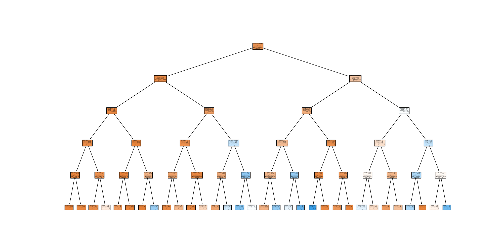

# Decision Tree Classifier - Bank Marketing Dataset

This project builds a **Decision Tree Classifier** to predict whether a customer will purchase a product or service based on their **demographic and behavioral data** from the Bank Marketing dataset.

## 📂 Dataset
- **Source**: [UCI Machine Learning Repository - Bank Marketing Dataset](https://archive.ics.uci.edu/ml/datasets/Bank+Marketing)
- **File Used**: `bank-full.csv`

## 🛠️ Features Used
- age, job, marital, education, default, balance, housing, loan
- contact, day, month, duration, campaign, pdays, previous
- poutcome

## 🎯 Target
- **y**: Whether the client subscribed to a term deposit (`yes` or `no`)

## 🔍 Model
- **Algorithm**: Decision Tree Classifier
- **Criterion**: Entropy
- **Library**: scikit-learn

## 📈 Results
- Accuracy, confusion matrix, classification report
- Visualized decision tree using `matplotlib`

### 🖼️ Decision Tree Visualization

